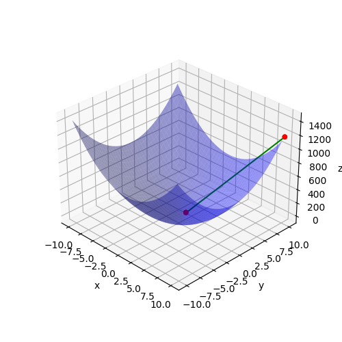

# sp4e-andrea-petras
Repo for sp4e course's homework for [Andrea Settimi](andrea.settimi@epfl.ch) and [Petras Vestartas](petras.vestartas@epfl.ch).

## Week 4: Generalized minimal residual method
*Exercice 1* can be found in `./week4/optimizer.py`
*Exercice 2* can be found in `./week4/GMRES.py`
*The command line application* can be found in `./week4/cmd.py`

<p>
    <figure align="center">
        
        
    </figure>
</p>
<p align="left"><i>On the first image: BFGS. On the second image: L-GMRES/GMRES</i></p>

#### **Dependencies**
You can use anaconda and create a new environment:
```
conda env create -f environment.yml
conda activate sp4e_week4
```
Or pip install `scipy==1.9.2` and `matplotlib==3.6.1`

#### **To run the code**
You can run the code with a command line from the main git directory and select which type of optimizer you want to use e.g., `--opt_type "LGMRES"`:
```bash
python ./week4/cmd.py
```
For more info:
```bash
usage: cmd.py [-h] [--opt_type {BFGS,LGMRES,GMRES}] [-nrows NROWS] [-A MATRIX [MATRIX ...]] [-b VECTOR [VECTOR ...]] [-x INITIAL_GUESS [INITIAL_GUESS ...]] [-t TOLERANCE] [-m MAX_ITER] [-p PLOT]

optional arguments:
  -h, --help            show this help message and exit
  --opt_type {BFGS,LGMRES,GMRES}
  -nrows NROWS          Number of rows for the matrix
  -A MATRIX [MATRIX ...], --matrix MATRIX [MATRIX ...]
                        The matrix A
  -b VECTOR [VECTOR ...], --vector VECTOR [VECTOR ...]
                        The vector b
  -x INITIAL_GUESS [INITIAL_GUESS ...], --initial_guess INITIAL_GUESS [INITIAL_GUESS ...]
                        the initial guess
  -t TOLERANCE, --tolerance TOLERANCE
                        the tolerance
  -m MAX_ITER, --max_iter MAX_ITER
                        the maximum number of iterations
  -p PLOT, --plot PLOT  whether to plot the result or not
```

#### **Notes**
> ⚠️ Passing a matrix to the commandline: `python ./week4/cmd.py -A 3 3 3 3 -nrows 2`